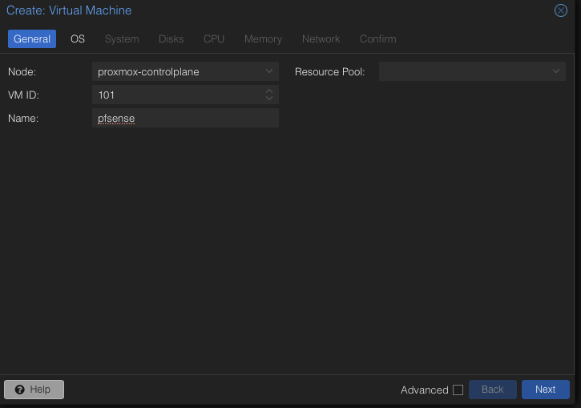
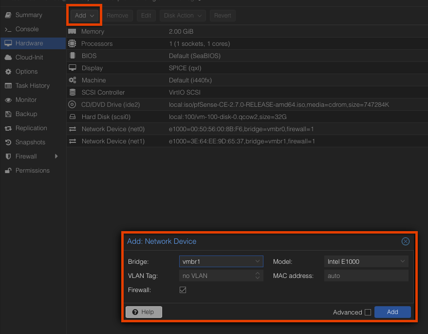
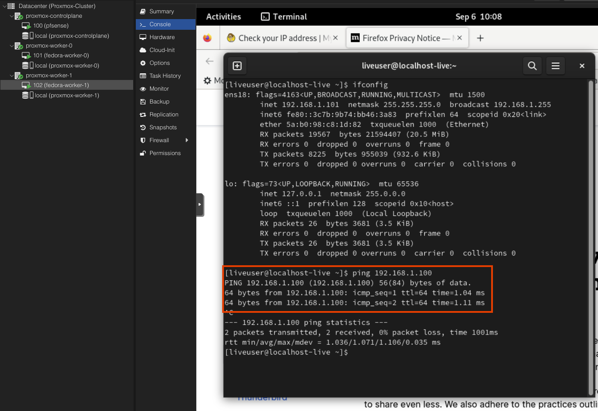

# Hetzner Proxmox VE HA Setup

This repo is about the installation of Proxmox 7.X on Hetzner with pfsense as firewall for WAN, IP floating with additional IP address for the VM's to allow SNAT.

# Hetzner Promox HA Architecture

# Create Controlplane Node

**NOTE:** I called it controlplane node, because it has the pfsense with allows SNAT to WAN. From the view of the architecture it is the controlplane node.
But from the view of the Proxmox cluster it is a worker node and have the same rights as the other worker nodes.

## 1. Install Proxmox on Hetzner (Controlplane)

    ssh root@138.201.31.244

    #run
    installimage

Chose the right image:

Change install config

From:

    SWRAIDLEVEL 1

To:

    SWRAIDLEVEL 0 (to use all Storage sda+sdb)

From:

    HOSTNAME Proxmox-Ve.localhost

To:

    proxmox-single.lab.local (you can call it what ever you want)

From:

    PART /boot ext3 512M
    PART lvm vg0 all

    LV vg0 root / ext3 15G
    LV vg0  swap swap swap 6G

To:

    PART /boot ext4 512M
    PART lvm vg0 all

    LV vg0 root / ext4 100G
    LV vg0  swap swap swap 24G  #(available RAM * 1/2)
    LV vg0 data /var/lib/vz ext4 3500G #(Remaining memory after deduction of root for storing images and containers)

The installation takes up to 15 minutes.

## 2. Set root password and disable port 111 or service

After installation a password must be assigned to the root user if access to the Hetzner machine is via ssh-key. The access will be done via the Linux PAM authentication module.

    passwd
    New password: xy...
    Retype new password:xy...

Proxmox opens port 111 by default, which is a security risk. Therefore, the port must be disabled.

    iptables -A INPUT -p tcp -m tcp --dport 111 -j DROP
    iptables -A INPUT -p udp -m udp --dport 111 -j DROP
    sudo /sbin/iptables-save

    ##if the service is not needed, then disable and mask it
    sudo systemctl disable --now rpcbind rpcbind.socket
    sudo systemctl mask rpcbind

## 3. Add additional IP-Address and fetch Metadata

To enable routing to external networks (SNAT), you'll need to request an extra IP address, since the primary IP of the Hetzner VM doesn't support this function.

You'll need to request a MAC address for the IP address. This MAC address will be later essential for the pfsense VM that handles routing to the WAN.

## 4. Config Network

Clone this git repository and execute the script:

    ./script/nework_config_controlplane.sh

All necessary information (main server ip, gateway, etc.) can be taken from the hetzner robot page like this:

MAIN-IP + Meta:

ADD-IP + Meta + MAC:

Here is my config:

    MAIN_SERVER_IP: 138.201.31.244
    MAIN_SERVER_GATEWAY_ADRESS: 138.201.31.193
    NETMASK: 255.255.255.192
    BROADCAST: 138.201.31.255
    ADDITIONAL_IP_ADRESS: 138.201.31.225
    NETWORK_INTERFACE: enp0s31f6
    VSWITCH_LAN: 4000
    NUMBER_OF_NODES (e.g. 3 Nodes (1x Master, 2x Worker, only Worker nodes needed) = 1 2): 1 2
    VSWITCH_COROSYNC: 4001
    IP_ADRESS_COROYSYNC (e.g. 10.0.100.10, 10.0.200.10, etc.) 10.0.100.10
    VSWITCH_COROSYNC: 4002
    IP_ADRESS_COROYSYNC (e.g. 10.0.100.10, 10.0.200.10, etc.) 10.0.200.10

**NOTE:** This node can be reached over Hetzner vSwitch 4001 over the IP 10.0.100.**10** or over vSwitch 4002 over the IP 10.0.200.**10**. I like HA-Setups, so I have two vSwitches for Corosync.

You will get an output like:

    source /etc/network/interfaces.d/\*

    auto lo
    iface lo inet loopback
    iface lo inet6 loopback

    iface enp0s31f6 inet manual

    up ip route add -net up ip route add -net 138.201.31.193 netmask 255.255.255.192 gw  138.201.31.193 vmbr0
    up sysctl -w net.ipv4.ip_forward=1
    up sysctl -w net.ipv4.conf.enp0s31f6.send_redirects=0
    up sysctl -w net.ipv6.conf.all.forwarding=1
    up ip route add 192.168.0.0/16 via 138.201.31.225 dev vmbr0
    up ip route add 172.16.0.0/12 via 138.201.31.225 dev vmbr0
    up ip route add 10.0.0.0/8 via 138.201.31.225 dev vmbr0

    iface enp0s31f6 inet6 static
    address 2a01:4f8:110:5143::2
    netmask 64
    gateway fe80::1

    auto vmbr0
    iface vmbr0 inet static
            address  138.201.31.244
            netmask  32
            gateway  138.201.31.193
            broadcast  138.201.31.255
            bridge-ports enp0s31f6
            bridge-stp off
            bridge-fd 0
            pointopoint 138.201.31.193
    #WAN

    # Virtual switch for DMZ
    # (connect your firewall/router KVM instance and private DMZ hosts here)
    auto vmbr1
    iface vmbr1 inet manual
            bridge_ports enp0s31f6.4000
            bridge_stp off
            bridge_fd 0
    #LAN0

    #vlan between nodes
    auto vmbr4001
    iface vmbr4001 inet static
            bridge_ports   enp0s31f6.4001
            bridge_stp      off
            bridge_fd       0
            address         10.0.100.10
            netmask         24
    #COROSYNC1

    #vlan between nodes
    auto vmbr4002
    iface vmbr4002 inet static
            bridge_ports   enp0s31f6.4002
            bridge_stp      off
            bridge_fd       0
            address         10.0.200.10
            netmask         24
    #COROSYNC2

# Create Worker Nodes [0]

## 1. Install Proxmox on Hetzner (Worker-0)

    ssh root@138.201.194.186

    #run
    installimage

Chose the right image:

Change install config

From:

    SWRAIDLEVEL 1

To:

    SWRAIDLEVEL 0 (to use all Storage sda+sdb)

From:

    HOSTNAME Proxmox-Ve.localhost

To:

    proxmox-single.lab.local (you can call it what ever you want)

From:

    PART /boot ext3 512M
    PART lvm vg0 all

    LV vg0 root / ext3 15G
    LV vg0  swap swap swap 6G

To:

    PART /boot ext4 512M
    PART lvm vg0 all

    LV vg0 root / ext4 100G
    LV vg0  swap swap swap 24G  #(available RAM * 1/2)
    LV vg0 data /var/lib/vz ext4 3500G #(Remaining memory after deduction of root for storing images and containers)

The installation takes up to 15 minutes.

## 2. Set root password and disable port 111

After installation a password must be assigned to the root user if access to the Hetzner machine is via ssh-key. The access will be done via the Linux PAM authentication module.

    passwd
    New password: xy...
    Retype new password:xy...

Proxmox opens port 111 by default, which is a security risk. Therefore, the port must be disabled.

    iptables -A INPUT -p tcp -m tcp --dport 111 -j DROP
    iptables -A INPUT -p udp -m udp --dport 111 -j DROP
    sudo /sbin/iptables-save

## 3. Config Network

All necessary information (main server ip, gateway, etc.) can be taken from the hetzner robot page like this:

MAIN-IP + Meta:

Clone this git repository and execute the script:

    ./script/nework_config_worker.sh

Here is my config:

    MAIN_SERVER_IP: 138.201.194.186
    MAIN_SERVER_GATEWAY_ADRESS: 138.201.194.129
    NETMASK: 255.255.255.192
    BROADCAST: 138.201.194.191
    NETWORK_INTERFACE: enp0s31f6
    VSWITCH_LAN: 4000
    NUMBER_OF_NODES (e.g. 3 Nodes (only slave nodes) = 1 2 3): 1 2
    VSWITCH_COROSYNC: 4001
    IP_ADRESS_COROYSYNC (e.g. 10.0.100.11, 10.0.200.11, etc.) 10.0.100.11
    VSWITCH_COROSYNC: 4002
    IP_ADRESS_COROYSYNC (e.g. 10.0.100.11, 10.0.200.11, etc.) 10.0.200.11

**NOTE:** This node can be reached over Hetzner vSwitch 4001 over the IP 10.0.100.**11** and over vSwitch 4002 over the IP 10.0.200.**11**

    source /etc/network/interfaces.d/*

    auto lo
    iface lo inet loopback
    iface lo inet6 loopback

    iface enp0s31f6 inet manual

    iface enp0s31f6 inet6 static
    address 2a01:4f8:110:5143::2
    netmask 64
    gateway fe80::1

    auto vmbr0
    iface vmbr0 inet static
            address  138.201.194.186
            netmask  32
            gateway  138.201.194.129
            broadcast  138.201.194.191
            bridge-ports enp0s31f6
            bridge-stp off
            bridge-fd 0
            pointopoint 138.201.194.129
    #WAN

    iface vmbr0 inet6 auto
            post-up echo 2048 > /sys/class/net/vmbr0/bridge/hash_max
            post-up echo 1 > /sys/class/net/vmbr0/bridge/multicast_snooping
            post-up echo 0 > /proc/sys/net/ipv6/conf/vmbr0/accept_ra

    up ip route add -net 138.201.194.129 netmask 255.255.255.224 gw 138.201.194.129 vmbr0
    up sysctl -w net.ipv4.ip_forward=1
    up sysctl -w net.ipv4.conf.enp0s31f6.send_redirects=0
    up sysctl -w net.ipv6.conf.all.forwarding=1

    # Virtual switch for DMZ
    # (connect your firewall/router KVM instance and private DMZ hosts here)
    auto vmbr1
    iface vmbr1 inet manual
            bridge_ports enp0s31f6.4000
            bridge_stp off
            bridge_fd 0
    #LAN0

    #vlan between nodes
    auto vmbr4001
    iface vmbr4001 inet static
            bridge_ports   enp0s31f6.4001
            bridge_stp      off
            bridge_fd       0
            address         10.0.100.11
            netmask         24
    #COROSYNC1

    #vlan between nodes
    auto vmbr4002
    iface vmbr4002 inet static
            bridge_ports   enp0s31f6.4002
            bridge_stp      off
            bridge_fd       0
            address         10.0.200.11
            netmask         24
    #COROSYNC2

# Create Worker Nodes [1]

## 1. Install Proxmox on Hetzner (Worker-1)

    ssh root@142.132.205.235

    #run
    installimage

Chose the right image:

Change install config

From:

    SWRAIDLEVEL 1

To:

    SWRAIDLEVEL 0 (to use all Storage sda+sdb)

From:

    HOSTNAME Proxmox-Ve.localhost

To:

    proxmox-single.lab.local (you can call it what ever you want)

From:

    PART /boot ext3 512M
    PART lvm vg0 all

    LV vg0 root / ext3 15G
    LV vg0  swap swap swap 6G

To:

    PART /boot ext4 512M
    PART lvm vg0 all

    LV vg0 root / ext4 100G
    LV vg0  swap swap swap 24G  #(available RAM * 1/2)
    LV vg0 data /var/lib/vz ext4 3500G #(Remaining memory after deduction of root for storing images and containers)

The installation takes up to 15 minutes.

## 2. Set root password and disable port 111

After installation a password must be assigned to the root user if access to the Hetzner machine is via ssh-key. The access will be done via the Linux PAM authentication module.

    passwd
    New password: xy...
    Retype new password:xy...

Proxmox opens port 111 by default, which is a security risk. Therefore, the port must be disabled.

    iptables -A INPUT -p tcp -m tcp --dport 111 -j DROP
    iptables -A INPUT -p udp -m udp --dport 111 -j DROP
    sudo /sbin/iptables-save

## 3. Config Network

All necessary information (main server ip, gateway, etc.) can be taken from the hetzner robot page like this:

MAIN-IP + Meta:

Clone this git repository and execute the script:

    ./script/nework_config_worker.sh

Here is my config:

    MAIN_SERVER_IP: 138.201.194.186
    MAIN_SERVER_GATEWAY_ADRESS: 138.201.194.129
    NETMASK: 255.255.255.192
    BROADCAST: 138.201.194.191
    NETWORK_INTERFACE: enp0s31f6
    VSWITCH_LAN: 4000
    NUMBER_OF_NODES (e.g. 3 Nodes (only slave nodes) = 1 2 3): 1 2
    VSWITCH_COROSYNC: 4001
    IP_ADRESS_COROYSYNC (e.g. 10.0.100.11, 10.0.200.11, etc.) 10.0.100.12
    VSWITCH_COROSYNC: 4002
    IP_ADRESS_COROYSYNC (e.g. 10.0.100.11, 10.0.200.11, etc.) 10.0.200.12

**NOTE:** This node can be reached over Hetzner vSwitch 4001 over the IP 10.0.100.**12** and over vSwitch 4002 over the IP 10.0.200.**12**

    source /etc/network/interfaces.d/*

    auto lo
    iface lo inet loopback
    iface lo inet6 loopback

    iface enp0s31f6 inet manual

    iface enp0s31f6 inet6 static
    address 2a01:4f8:110:5143::2
    netmask 64
    gateway fe80::1

    auto vmbr0
    iface vmbr0 inet static
            address  138.201.194.186
            netmask  32
            gateway  138.201.194.129
            broadcast  138.201.194.191
            bridge-ports enp0s31f6
            bridge-stp off
            bridge-fd 0
            pointopoint 138.201.194.129
    #WAN

    iface vmbr0 inet6 auto
            post-up echo 2048 > /sys/class/net/vmbr0/bridge/hash_max
            post-up echo 1 > /sys/class/net/vmbr0/bridge/multicast_snooping
            post-up echo 0 > /proc/sys/net/ipv6/conf/vmbr0/accept_ra

    up ip route add -net 138.201.194.129 netmask 255.255.255.224 gw 138.201.194.129 vmbr0
    up sysctl -w net.ipv4.ip_forward=1
    up sysctl -w net.ipv4.conf.enp0s31f6.send_redirects=0
    up sysctl -w net.ipv6.conf.all.forwarding=1

    # Virtual switch for DMZ
    # (connect your firewall/router KVM instance and private DMZ hosts here)
    auto vmbr1
    iface vmbr1 inet manual
            bridge_ports enp0s31f6.4000
            bridge_stp off
            bridge_fd 0
    #LAN0

    #vlan between nodes
    auto vmbr4001
    iface vmbr4001 inet static
            bridge_ports   enp0s31f6.4001
            bridge_stp      off
            bridge_fd       0
            address         10.0.100.11
            netmask         24
    #COROSYNC1

    #vlan between nodes
    auto vmbr4002
    iface vmbr4002 inet static
            bridge_ports   enp0s31f6.4002
            bridge_stp      off
            bridge_fd       0
            address         10.0.200.11
            netmask         24
    #COROSYNC2

# Create Proxmox Cluster

## 1. Create the vSwitches on hetzner robot and add servers like:

## 2. Check the connection over vSwitches like:

`controlplane` ---> vSwitch (4001) --> `worker-0` and `controlplane` ---> vSwitch (4002) --> `worker-0`

    root@proxmox-controlplane ~ # ping 10.0.100.11
    PING 10.0.100.11 (10.0.100.11) 56(84) bytes of data.
    64 bytes from 10.0.100.11: icmp_seq=1 ttl=64 time=0.519 ms
    64 bytes from 10.0.100.11: icmp_seq=2 ttl=64 time=0.515 ms
    --- 10.0.100.11 ping statistics ---
    2 packets transmitted, 2 received, 0% packet loss, time 1029ms
    rtt min/avg/max/mdev = 0.515/0.517/0.519/0.002 ms

    root@proxmox-controlplane ~ # ping 10.0.200.11
    PING 10.0.200.11 (10.0.200.11) 56(84) bytes of data.
    64 bytes from 10.0.200.11: icmp_seq=1 ttl=64 time=0.524 ms
    64 bytes from 10.0.200.11: icmp_seq=2 ttl=64 time=0.510 ms
    --- 10.0.200.11 ping statistics ---
    2 packets transmitted, 2 received, 0% packet loss, time 1006ms
    rtt min/avg/max/mdev = 0.510/0.517/0.524/0.007 ms

`controlplane` ---> vSwitch (4001) --> `worker-1` and `controlplane` ---> vSwitch (4002) --> `worker-1`

    root@proxmox-controlplane ~ # ping 10.0.100.12
    PING 10.0.100.12 (10.0.100.12) 56(84) bytes of data.
    64 bytes from 10.0.100.12: icmp_seq=1 ttl=64 time=0.566 ms
    64 bytes from 10.0.100.12: icmp_seq=2 ttl=64 time=0.552 ms
    64 bytes from 10.0.100.12: icmp_seq=3 ttl=64 time=0.578 ms
    --- 10.0.100.12 ping statistics ---
    3 packets transmitted, 3 received, 0% packet loss, time 2033ms
    rtt min/avg/max/mdev = 0.552/0.565/0.578/0.010 ms

    root@proxmox-controlplane ~ # ping 10.0.200.12
    PING 10.0.200.12 (10.0.200.12) 56(84) bytes of data.
    64 bytes from 10.0.200.12: icmp_seq=1 ttl=64 time=1.44 ms
    64 bytes from 10.0.200.12: icmp_seq=2 ttl=64 time=0.543 ms
    64 bytes from 10.0.200.12: icmp_seq=3 ttl=64 time=0.562 ms
    --- 10.0.200.12 ping statistics ---
    3 packets transmitted, 3 received, 0% packet loss, time 2009ms
    rtt min/avg/max/mdev = 0.543/0.848/1.441/0.418 ms

`worker-0` ---> vSwitch (4001) --> `controlplane` and `worker-0` ---> vSwitch (4002) --> `controlplane`

    root@proxmox-worker-0 ~ # ping 10.0.100.10
    PING 10.0.100.10 (10.0.100.10) 56(84) bytes of data.
    64 bytes from 10.0.100.10: icmp_seq=1 ttl=64 time=0.533 ms
    64 bytes from 10.0.100.10: icmp_seq=2 ttl=64 time=0.523 ms
    --- 10.0.100.10 ping statistics ---
    2 packets transmitted, 2 received, 0% packet loss, time 1029ms
    rtt min/avg/max/mdev = 0.523/0.528/0.533/0.005 ms

    root@proxmox-worker-0 ~ # ping 10.0.200.10
    PING 10.0.200.10 (10.0.200.10) 56(84) bytes of data.
    64 bytes from 10.0.200.10: icmp_seq=1 ttl=64 time=0.510 ms
    64 bytes from 10.0.200.10: icmp_seq=2 ttl=64 time=0.506 ms
    64 bytes from 10.0.200.10: icmp_seq=3 ttl=64 time=0.514 ms
    --- 10.0.200.10 ping statistics ---
    3 packets transmitted, 3 received, 0% packet loss, time 2047ms
    rtt min/avg/max/mdev = 0.506/0.510/0.514/0.003 ms

`worker-1` ---> vSwitch (4001) --> `controlplane` and `worker-1` ---> vSwitch (4002) --> `controlplane`

    root@proxmox-worker-0 ~ # ping 10.0.100.10
    PING 10.0.100.10 (10.0.100.10) 56(84) bytes of data.
    64 bytes from 10.0.100.10: icmp_seq=1 ttl=64 time=0.533 ms
    64 bytes from 10.0.100.10: icmp_seq=2 ttl=64 time=0.523 ms
    --- 10.0.100.10 ping statistics ---
    2 packets transmitted, 2 received, 0% packet loss, time 1029ms
    rtt min/avg/max/mdev = 0.523/0.528/0.533/0.005 ms

    root@proxmox-worker-0 ~ # ping 10.0.200.10
    PING 10.0.200.10 (10.0.200.10) 56(84) bytes of data.
    64 bytes from 10.0.200.10: icmp_seq=1 ttl=64 time=0.510 ms
    64 bytes from 10.0.200.10: icmp_seq=2 ttl=64 time=0.506 ms
    64 bytes from 10.0.200.10: icmp_seq=3 ttl=64 time=0.514 ms
    --- 10.0.200.10 ping statistics ---
    3 packets transmitted, 3 received, 0% packet loss, time 2047ms
    rtt min/avg/max/mdev = 0.506/0.510/0.514/0.003 ms

`worker-0` ---> vSwitch (4001) --> `worker-1` and `worker-0` ---> vSwitch (4002) --> `worker-0`

    root@proxmox-worker-0 ~ # ping 10.0.200.12
    PING 10.0.200.12 (10.0.200.12) 56(84) bytes of data.
    64 bytes from 10.0.200.12: icmp_seq=1 ttl=64 time=0.575 ms
    64 bytes from 10.0.200.12: icmp_seq=2 ttl=64 time=0.572 ms
    --- 10.0.200.12 ping statistics ---
    2 packets transmitted, 2 received, 0% packet loss, time 1015ms
    rtt min/avg/max/mdev = 0.572/0.573/0.575/0.001 ms

    root@proxmox-worker-0 ~ # ping 10.0.100.12
    PING 10.0.100.12 (10.0.100.12) 56(84) bytes of data.
    64 bytes from 10.0.100.12: icmp_seq=1 ttl=64 time=1.38 ms
    64 bytes from 10.0.100.12: icmp_seq=2 ttl=64 time=0.569 ms
    --- 10.0.100.12 ping statistics ---
    2 packets transmitted, 2 received, 0% packet loss, time 1002ms
    rtt min/avg/max/mdev = 0.569/0.974/1.379/0.405 ms

`worker-1` ---> vSwitch (4001) --> `worker-0` and `worker-1` ---> vSwitch (4002) --> `worker-0`

    root@proxmox-worker-1 ~ # ping 10.0.100.11
    PING 10.0.100.11 (10.0.100.11) 56(84) bytes of data.
    64 bytes from 10.0.100.11: icmp_seq=1 ttl=64 time=0.573 ms
    64 bytes from 10.0.100.11: icmp_seq=2 ttl=64 time=0.555 ms
    64 bytes from 10.0.100.11: icmp_seq=3 ttl=64 time=0.467 ms
    --- 10.0.100.11 ping statistics ---
    3 packets transmitted, 3 received, 0% packet loss, time 2044ms
    rtt min/avg/max/mdev = 0.467/0.531/0.573/0.046 ms

    root@proxmox-worker-1 ~ # ping 10.0.200.11
    PING 10.0.200.11 (10.0.200.11) 56(84) bytes of data.
    64 bytes from 10.0.200.11: icmp_seq=1 ttl=64 time=0.566 ms
    64 bytes from 10.0.200.11: icmp_seq=2 ttl=64 time=0.549 ms
    --- 10.0.200.11 ping statistics ---
    2 packets transmitted, 2 received, 0% packet loss, time 1027ms
    rtt min/avg/max/mdev = 0.549/0.557/0.566/0.008 ms

## 3. Create the Proxmox Cluster

**NOTE:** Proxmox uses a Corosync cluster engine, which uses a quorum-based voting technique to ensure consistent configuration among all the nodes of a cluster. The cluster configuration is distributed to all nodes with the help of a Proxmox cluster file system (pmxcfs).

Open the Controlplane UI (https://138.201.31.244:8006) and click on create cluster, select the both vSwitches as link 0 and link 1.

After that you should have view like:

Worker-0: Copy the join information. Open the UI from a Worker node (https://138.201.194.186:8006) and join the cluster with:

After successful join, you should have view like:

Worker-1: Copy the join information. Open the UI from a Worker node (https://142.132.205.235:8006) and join the cluster with:

After successful join, you should have view like:

Congrats, you have created your Proxmox Cluster!!

## 4. Upload images (pfsense and fedora)

Now we are going, to create the VMs. First we need to upload the images.

## 5. Create VM and install pfsense on Controlplane

Now start the pfsense (VM) and install with default settings. After the successful installation you should get an output like:

## 6. Create VM and install fedora (workstation) on Worker-0

**NOTE:** You need first upload the fedora image to the locao storage of the worker-0 node.

The steps are identical to pfsense except for the choice of bridge. There vmbr1 (DMZ/LAN) must be selected.

If you check the IP-Address from the created VM (in my case fedora workstation) like:

You can now also make ping test to the fedora vm running on worker-1 node like:

## 7. Create VM and install fedora (workstation) on Worker-1

**NOTE:** You need first upload the fedora image to the locao storage of the worker-1 node.

The steps are identical to pfsense except for the choice of bridge. There vmbr1 (DMZ/LAN) must be selected.

If you check the IP-Address from the created VM (in my case fedora workstation) like:

You will see the ADD-IP-Address. So SNAT is working and you can extend to config pfsense over the UI for your purpose.

You can now also make ping test to the fedora vm running on worker-0 node like:

## 8. Config pfsense over UI

Open on every vm https://192.168.1.1 like:

and login with default credentials are set to **username:** **_admin_** with **password:** **_pfsense_**.

## **Finished, enjoy your Proxmox HA Environment!**
